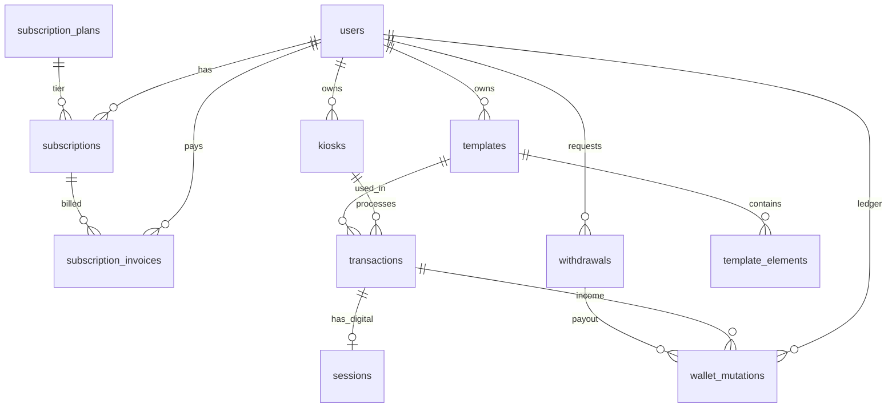

# PRD-00: Master PRD — memoir. Platform Overview

> **Versi:** 1.0
> **Tanggal:** 5 Maret 2026
> **Status:** Draft — For Review
> **Audiens:** Internal dev team & AI coding agents

---

## 1. Executive Summary

### 1.1 Problem Statement

Operator photobooth saat ini harus membangun sendiri sistem kasir, manajemen file, template desain, integrasi printer, dan infrastruktur pembayaran yang membutuhkan keahlian teknis tinggi dan waktu pengembangan lama. Tidak ada platform turnkey yang menyasar segmen ini, sehingga barrier to entry sangat tinggi dan operator fokus pada infrastruktur daripada bisnis mereka.

### 1.2 Proposed Solution

**memoir.** adalah platform B2B2C SaaS yang memungkinkan siapa saja membangun dan mengoperasikan bisnis photobooth receipt tanpa membangun sistem dari nol. Platform menyediakan infrastruktur lengkap: manajemen template visual, sistem pembayaran, subscription management, wallet & withdrawal, hingga aplikasi kiosk runner untuk device booth fisik.

Owner berlangganan (tiered subscription), mengelola booth via dashboard web, dan seluruh pendapatan transaksi booth masuk ke wallet mereka. memoir. mengambil revenue dari subscription, bukan potongan per-transaksi.

### 1.3 Proposisi Nilai

- **Zero-coding setup** — Owner cukup daftar, setup template, kiosk siap jalan
- **Multi-kiosk management** — Satu dashboard untuk semua booth
- **Subscription-based revenue** — Tidak ada potongan per transaksi, owner terima 100% pendapatan booth
- **Cross-platform kiosk runner** — Tersedia untuk desktop (Electron) dan mobile (Android/Flutter)
- **Semi-offline capable** — Kiosk bisa beroperasi tanpa internet untuk pembayaran CASH/QRIS statis

### 1.4 Success Criteria

| #   | KPI                           | Target                                                      | Cara Ukur         |
| --- | ----------------------------- | ----------------------------------------------------------- | ----------------- |
| 1   | **Time-to-first-transaction** | < 10 menit dari kiosk pairing sampai transaksi pertama      | Manual testing    |
| 2   | **API response time**         | p99 < 300ms untuk semua endpoint non-upload                 | APM / load test   |
| 3   | **Platform uptime**           | ≥ 99.5% (monthly)                                           | Uptime monitoring |
| 4   | **Zero revenue leak**         | 0 duplikat wallet mutation per transaksi/invoice            | Idempotency check |
| 5   | **Kiosk offline session**     | 100% CASH/QRIS bisa berjalan tanpa internet setelah startup | Integration test  |

---

## 2. Target Users & Personas

| Persona                        | Deskripsi                                            | Kebutuhan Utama                                                                   | Surface                         |
| ------------------------------ | ---------------------------------------------------- | --------------------------------------------------------------------------------- | ------------------------------- |
| **P1 — Platform Admin**        | Tim internal memoir.                                 | Onboard owner, kelola plan, proses withdrawal, monitoring                         | Dashboard Super Admin (Web)     |
| **P2 — Studio Owner**          | Pemilik bisnis photobooth yang berlangganan platform | Kelola template, kiosk, lihat transaksi, tarik saldo, kelola subscription         | Dashboard Owner (Web)           |
| **P3 — Booth Operator**        | Orang yang menjalankan booth fisik sehari-hari       | Pair kiosk, konfigurasi device, konfirmasi pembayaran cash, troubleshoot hardware | Kiosk Runner (Desktop / Mobile) |
| **P4 — Customer / Pengunjung** | Pengguna akhir di lokasi booth                       | Pilih template, foto, bayar, terima cetakan / digital copy                        | Kiosk Runner (via operator)     |

> **Catatan:** P4 (Customer) tidak berinteraksi langsung dengan API. Semua interaksi melalui Kiosk Runner yang dioperasikan P3.

---

## 3. Platform Architecture Overview

### 3.1 Gambaran Umum

```
┌─────────────────────────────────────────────────────────────────────┐
│                         memoir. Platform                            │
│                                                                     │
│  ┌───────────────┐  ┌───────────────┐  ┌───────────┐  ┌───────────┐ │
│  │   PRD-03      │  │   PRD-02      │  │  PRD-04   │  │  PRD-05   │ │
│  │   Dashboard   │  │   Dashboard   │  │  Desktop  │  │  Mobile   │ │
│  │   Super Admin │  │   Owner       │  │  Kiosk    │  │  Kiosk    │ │
│  │   (Web)       │  │   (Web)       │  │  Runner   │  │  Runner   │ │
│  │               │  │               │  │ (Electron)│  │ (Flutter) │ │
│  └───────┬───────┘  └───────┬───────┘  └─────┬─────┘  └─────┬─────┘ │
│          │                  │                │              │       │
│          └──────────────────┴────────┬───────┴──────────────┘       │
│                                      │                              │
│                              REST API (HTTPS)                       │
│                                      │                              │
│                          ┌───────────┴───────────┐                  │
│                          │       PRD-01          │                  │
│                          │     Backend API       │                  │
│                          │   (Fastify + Node.js) │                  │
│                          └───────────┬───────────┘                  │
│                                      │                              │
│                  ┌───────────────────┼───────────────────┐          │
│                  │                   │                   │          │
│          ┌───────┴───────┐           │           ┌───────┴───────┐  │
│          │   Supabase    │           │           │    Xendit     │  │
│          │  PostgreSQL   │           │           │  (Payment GW) │  │
│          └───────────────┘           │           └───────────────┘  │
└──────────────────────────────────────┴──────────────────────────────┘
```

### 3.2 Komunikasi Antar Komponen

Semua client (Web Dashboard, Kiosk Runner Desktop, Kiosk Runner Mobile) berkomunikasi dengan **satu Backend API** melalui REST API via HTTPS. Tidak ada komunikasi langsung antar client.

- **Web Dashboard (Owner & Admin):** Autentikasi via JWT (access token + refresh token via HttpOnly cookie)
- **Kiosk Runner (Desktop & Mobile):** Autentikasi via `device_token` (JWT long-lived, ~10 tahun) yang didapat melalui proses pairing 6-digit code
- **Semua request** menggunakan header `Authorization: Bearer {token}`
- Tidak ada WebSocket / push notification untuk MVP — semua berbasis request-response / polling on-demand

---

## 4. Component PRD Index

| PRD ID | Komponen                      | File                                                       | Deskripsi                                                      | Status      |
| ------ | ----------------------------- | ---------------------------------------------------------- | -------------------------------------------------------------- | ----------- |
| PRD-00 | Master PRD                    | `PRD-00-master.md`                                         | Dokumen ini — platform overview                                | Draft       |
| PRD-01 | Backend API                   | [`PRD-01-backend-api.md`](./PRD-01-backend-api.md)         | REST API, database, business logic, Clean Architecture         | In Progress |
| PRD-02 | Dashboard Owner (Web)         | [`PRD-02-dashboard-owner.md`](./PRD-02-dashboard-owner.md) | Owner management: template editor, kiosk, wallet, subscription | Draft       |
| PRD-03 | Dashboard Super Admin (Web)   | [`PRD-03-dashboard-admin.md`](./PRD-03-dashboard-admin.md) | Admin management: owner onboarding, withdrawal, monitoring     | Draft       |
| PRD-04 | Desktop Kiosk Runner          | [`PRD-04-desktop-runner.md`](./PRD-04-desktop-runner.md)   | Aplikasi Electron di booth fisik (PC/laptop)                   | Draft       |
| PRD-05 | Mobile Kiosk Runner (Android) | [`PRD-05-mobile-runner.md`](./PRD-05-mobile-runner.md)     | Aplikasi Flutter di tablet/phone Android                       | Draft       |

---

## 5. Tech Stack Overview

| Komponen                  | Teknologi Utama                                                                | Catatan                                                                      |
| ------------------------- | ------------------------------------------------------------------------------ | ---------------------------------------------------------------------------- |
| **Backend API**           | Node.js 22 LTS, Fastify 5.x, TypeScript, Drizzle ORM, Zod                      | Clean Architecture 4-layer                                                   |
| **Database**              | PostgreSQL 15+ (via Supabase)                                                  | 12 tabel, monetary values dalam `bigint` (IDR)                               |
| **File Storage**          | Supabase Storage                                                               | Background template, overlay, asset, digital copy foto                       |
| **Payment Gateway**       | Xendit                                                                         | Untuk transaksi booth (PG) dan pembayaran subscription                       |
| **Dashboard Owner**       | Next.js (App Router), React 19, TypeScript, Tailwind CSS, shadcn/ui, Konva     | Template editor visual berbasis canvas                                       |
| **Dashboard Super Admin** | Next.js (App Router), React 19, TypeScript, Tailwind CSS, shadcn/ui            | Stack identik dengan Owner, deployment terpisah                              |
| **Desktop Kiosk Runner**  | Electron, electron-vite, React 19, TypeScript, XState 5, Zustand, Tailwind CSS | Fullscreen kiosk, tanpa URL routing (XState manage flow)                     |
| **Mobile Kiosk Runner**   | Flutter (Dart), Android                                                        | Fitur identik dengan desktop runner                                          |
| **Auth (Web)**            | JWT access token + refresh token (HttpOnly cookie)                             | jose library                                                                 |
| **Auth (Kiosk)**          | `device_token` (JWT long-lived ~10 tahun)                                      | Disimpan terenkripsi via `safeStorage` (Electron) / secure storage (Flutter) |
| **Linting**               | Biome (backend), —                                                             | —                                                                            |
| **Testing**               | Vitest + Supertest (backend)                                                   | —                                                                            |
| **Package Manager**       | pnpm (backend, desktop), npm (web dashboard)                                   | —                                                                            |

> Detail tech stack per komponen ada di masing-masing PRD komponen.

---

## 6. Business Model & Subscription

### 6.1 Model Revenue

memoir. menggunakan **subscription tiered per owner**. Platform tidak mengambil potongan dari transaksi sesi foto seluruh pendapatan booth masuk ke wallet owner. Revenue memoir. berasal dari tagihan langganan (monthly / yearly).

### 6.2 Tier Langganan (Contoh)

Tier dan harga dikonfigurasi oleh platform admin via dashboard (tidak hardcode).

| Tier     | Max Kiosk | Harga Bulanan | Harga Tahunan |
| -------- | --------- | ------------- | ------------- |
| Starter  | 1 booth   | Rp 99.000     | Rp 990.000    |
| Pro      | 3 booth   | Rp 249.000    | Rp 2.490.000  |
| Business | 10 booth  | Rp 599.000    | Rp 5.990.000  |

> Nilai di atas adalah contoh. Semua dikelola via platform admin dashboard.

### 6.3 Business Rules Subscription

- Satu owner hanya boleh memiliki **satu subscription ACTIVE** pada satu waktu
- Subscription dibuat dengan status **`PENDING_PAYMENT`** — belum bisa digunakan sampai pembayaran dikonfirmasi
- **Upgrade/change plan aman**: saat owner upgrade, backend membuat **subscription row baru** (`PENDING_PAYMENT`) tanpa menyentuh subscription ACTIVE yang sudah ada. Subscription lama tetap berjalan selama pembayaran plan baru belum selesai.
- Diperbolehkan membuat subscription baru meskipun sudah ada PENDING_PAYMENT (di-log sebagai warning, tidak di-reject).
- **Status dihitung secara lazy** tidak ada cron job. Backend menghitung status saat request masuk:
  - `PENDING_PAYMENT` → menunggu pembayaran (kiosk tidak bisa beroperasi **untuk subscription ini**)
  - `now ≤ current_period_end` → **ACTIVE**
  - `now ≤ current_period_end + grace_period_days` → **GRACE_PERIOD** (kiosk masih beroperasi)
  - Setelah grace period habis → **EXPIRED** (kiosk terkunci)
  - Owner bisa **CANCELLED** secara manual
- Re-subscribe ke plan+period yang sama saat ACTIVE ditolak (409 Conflict)
- Enforcement `max_kiosks`: saat owner tambah kiosk, backend cek jumlah kiosk aktif vs limit plan
- Grace period dikonfigurasi via `platform_config` (key: `grace_period_days`), hanya ditampilkan saat status `GRACE_PERIOD`
- Settlement dilakukan via webhook Xendit. Check-payment hanya membaca status dari database (read-only).
- **GET /subscription** selalu memprioritaskan subscription ACTIVE. Field `pendingUpgrade` ditambahkan untuk menunjukkan jika ada pending upgrade.

### 6.4 Metode Pembayaran Booth (3 jenis)

| Metode          | Deskripsi                                             | Perlu Internet             |
| --------------- | ----------------------------------------------------- | -------------------------- |
| **CASH**        | Bayar tunai ke operator, konfirmasi manual via tombol | ❌ Tidak (setelah startup) |
| **STATIC_QRIS** | Scan QR statis, konfirmasi manual via tombol          | ❌ Tidak (setelah startup) |
| **PG (Xendit)** | QRIS dinamis via Xendit Payment Request v3 API        | ✅ Ya                      |

### 6.5 Wallet & Withdrawal

- Setiap transaksi booth yang berstatus PAID otomatis menambah saldo wallet owner (`wallet_mutation` CREDIT)
- Owner bisa request withdrawal melalui dashboard → admin approve/reject secara manual
- Transfer dana ke rekening dilakukan manual oleh tim memoir. di luar sistem, sistem hanya mencatat status
- Max 1 withdrawal PENDING per owner pada satu waktu
- Minimum withdrawal dikonfigurasi via `platform_config`

### 6.6 Lifecycle Invoice Subscription

```
Owner pilih plan + billing period
        │
        ▼
Backend buat subscription BARU (PENDING_PAYMENT) + invoice (PENDING)
        │  └─ Subscription ACTIVE yang lama TIDAK disentuh
        │  └─ Warning jika sudah ada PENDING_PAYMENT (diperbolehkan, tidak di-reject)
        │  └─ Operasi DB dalam UnitOfWork transaction
        ▼
PG call (di luar transaction) → dapatkan QR string (QRIS dinamis via Xendit v3 API)
        │  └─ Jika PG gagal: subscription tetap PENDING_PAYMENT, client retry via check-payment
        ▼
Owner scan QR code untuk bayar
        │
        ├─── Jalur 1: Webhook otomatis
        │    Xendit kirim POST /webhooks/xendit → backend auto-settle
        │
        ├─── Jalur 2: Manual check (button)
        │    Owner klik "Cek Status" → POST /subscription/invoices/:id/check-payment
        │
        ▼
Backend settle payment:
  ├─ settlement → Atomic (1 transaction):
  │    1. Invoice PAID
  │    2. Subscription baru ACTIVE
  │    3. Subscription lama CANCELLED (jika ada, upgrade scenario)
  ├─ expire/cancel → Atomic:
  │    1. Invoice FAILED
  │    2. Subscription baru EXPIRED (subscription lama tetap ACTIVE)
  └─ PG error → return PENDING (no state change, safe retry)
```

---

## 7. Data Model Overview

### 7.1 Entitas Utama

Database terdiri dari **12 tabel** utama. Semua monetary value disimpan sebagai `bigint` dalam satuan Rupiah (IDR).



### 7.2 Daftar Tabel

| Tabel                   | Deskripsi                     | Catatan Kritis                                                                 |
| ----------------------- | ----------------------------- | ------------------------------------------------------------------------------ |
| `users`                 | Admin & owner accounts        | Soft-delete; `wallet_balance` = cache, harus sync atomic dengan mutations      |
| `subscription_plans`    | Tier langganan                | Admin-managed; `max_kiosks` enforced di app layer                              |
| `subscriptions`         | Subscription aktif per owner  | 1 ACTIVE per owner (app layer enforce)                                         |
| `subscription_invoices` | Invoice per billing event     | `order_id` unik; idempotency check wajib                                       |
| `platform_config`       | Key-value settings platform   | Keys: `grace_period_days`, `minimum_withdrawal_amount`, `default_plan_id`      |
| `kiosks`                | Device booth records          | Soft-delete; `device_token` null setelah re-pairing; `pairing_code_expires_at` |
| `templates`             | Template layout cetak         | `updated_at` wajib di-touch setiap mutasi elemen (sync signal untuk kiosk)     |
| `template_elements`     | Elemen template (polymorphic) | Single-table; 4 tipe: `photo_slot`, `image`, `text`, `shape`; cascade-delete   |
| `transactions`          | Transaksi booth               | Price snapshot immutable; `owner_id` denormalized                              |
| `sessions`              | Digital copy foto             | 1:1 dengan transaction; hanya jika `has_digital_copy = true`                   |
| `wallet_mutations`      | Immutable financial ledger    | Hanya 1 ref (transaction xor withdrawal) per row                               |
| `withdrawals`           | Owner payout requests         | Atomic approve: wallet debit + status update dalam 1 DB transaction            |

### 7.3 Enums

| Enum                  | Values                                                              |
| --------------------- | ------------------------------------------------------------------- |
| `user_role`           | `platform_admin`, `studio_owner`                                    |
| `tx_status`           | `PENDING`, `PAID`, `FAILED`                                         |
| `payment_method`      | `PG`, `CASH`, `STATIC_QRIS`                                         |
| `mutation_type`       | `CREDIT`, `DEBIT`                                                   |
| `mutation_category`   | `TRANSACTION_INCOME`, `WITHDRAWAL`, `ADJUSTMENT`                    |
| `billing_period`      | `MONTHLY`, `YEARLY`                                                 |
| `subscription_status` | `ACTIVE`, `PENDING_PAYMENT`, `EXPIRED`, `CANCELLED`, `GRACE_PERIOD` |
| `withdrawal_status`   | `PENDING`, `PROCESSED`, `REJECTED`                                  |
| `element_type`        | `photo_slot`, `image`, `text`, `shape`                              |

### 7.4 Template Elements | Model Polymorphic

Setiap template terdiri dari kumpulan elemen dengan 4 tipe berbeda, disimpan dalam satu tabel (`template_elements`) dengan pola single-table polymorphism.

**Atribut spasial (berlaku semua tipe):** `x`, `y`, `width`, `height`, `rotation`, `opacity`, `sequence` (z-index)

**Atribut spesifik per tipe (JSONB `properties`):**

| Tipe         | Deskripsi                               | Properties                                                                             |
| ------------ | --------------------------------------- | -------------------------------------------------------------------------------------- |
| `photo_slot` | Area tempat foto customer ditempelkan   | `{ captureOrder, borderRadius?, borderWidth?, borderColor? }`                          |
| `image`      | Gambar statis dekoratif (sticker, logo) | `{ imageUrl, fit: "cover"\|"contain"\|"fill", borderRadius? }`                         |
| `text`       | Teks statis (judul, tanggal, branding)  | `{ content, fontFamily, fontSize, fontWeight, color, textAlign, letterSpacing? }`      |
| `shape`      | Bentuk geometris                        | `{ shapeType: "rect"\|"circle"\|"line", fill?, stroke?, strokeWidth?, borderRadius? }` |

> Schema database lengkap tersedia di `memoir_schema_v3.dbml` (referensi terpisah).

---

## 8. Shared Conventions & Standards

### 8.1 Authentication & Authorization

| Surface                      | Mekanisme                         | Token                                 | Penyimpanan                                                           | Expiry                                                    |
| ---------------------------- | --------------------------------- | ------------------------------------- | --------------------------------------------------------------------- | --------------------------------------------------------- |
| **Web (Admin & Owner)**      | JWT access token + refresh token  | Access: JWT, Refresh: HttpOnly cookie | Access: localStorage, Refresh: cookie                                 | Access: short-lived (configurable), Refresh: longer-lived |
| **Kiosk (Desktop & Mobile)** | `device_token` (JWT) saat pairing | JWT signed `{ kioskId, ownerId }`     | Desktop: electron-store + safeStorage, Mobile: Flutter secure storage | ~10 tahun (default)                                       |

**Penting:**

- Backend menggunakan **service_role key** Supabase — RLS tidak digunakan
- Authorization ditangani di **application layer** (JWT payload: `{ id, role }`)
- Admin & owner Self-registration tidak tersedia — akun owner dibuat oleh admin
- `POST /auth/refresh` untuk mendapatkan access token baru tanpa re-login
- `POST /auth/logout` untuk revoke refresh token

### 8.2 API Design Conventions

- **Base path:** `/api/v1`
- **Response format (success):** `{ data: ... }`
- **Response format (error):** `{ error: "ERROR_CODE", message: "..." }`
- **Response format (paginated):** `{ data: [...], meta: { page, limit, total } }`
- **Field naming:** camelCase di semua response
- **Monetary values:** `bigint` (IDR, unit: rupiah) tidak pernah floating-point
- **Timestamps:** ISO 8601 format
- **IDs:** UUID v4

### 8.3 Error Handling

Setiap client harus handle error codes dari backend secara konsisten:

| HTTP Status | Contoh Error Code                                            | Penanganan                                     |
| ----------- | ------------------------------------------------------------ | ---------------------------------------------- |
| 400         | `VALIDATION_ERROR`, `PRICE_MISMATCH`, `INSUFFICIENT_BALANCE` | Tampilkan pesan spesifik                       |
| 401         | `UNAUTHORIZED`                                               | Clear token, redirect ke login / layar pairing |
| 403         | `FORBIDDEN`, `MAX_KIOSKS_REACHED`                            | Tampilkan pesan, disable action                |
| 404         | `NOT_FOUND`                                                  | Redirect ke list + pesan                       |
| 409         | `CONFLICT`, `PENDING_WITHDRAWAL_EXISTS`                      | Tampilkan pesan spesifik                       |
| 429         | `RATE_LIMITED`                                               | Tampilkan pesan throttle                       |
| 500         | `INTERNAL_SERVER_ERROR`                                      | Pesan generik, retry                           |

### 8.4 Key Design Decisions

| Keputusan               | Pilihan                       | Alasan                                           |
| ----------------------- | ----------------------------- | ------------------------------------------------ |
| Monorepo vs Multi-repo? | **Multi-repo**                | Repo terpisah per app, fully independent deploy  |
| Registration model?     | **Admin-only**                | Owner tidak self-register, admin buat akun       |
| Payment status check?   | **Webhook + manual button**   | Xendit webhook auto-settle + manual check button |
| Subscription status?    | **Lazy-computed**             | Tidak ada cron job, status dihitung saat request |
| Kiosk session flow?     | **Foto dulu, bayar kemudian** | Customer "coba dulu" melihat hasil sebelum bayar |
| Currency?               | **IDR only**                  | Single-currency, `bigint` tanpa decimal          |

---

## 9. Non-Functional Requirements

| Aspek                 | Requirement                                                                                                                   |
| --------------------- | ----------------------------------------------------------------------------------------------------------------------------- |
| **Ketersediaan**      | Target uptime API 99.5%. Kiosk bisa berjalan semi-offline untuk CASH/QRIS statis setelah startup                              |
| **Performa API**      | Response endpoint kiosk < 500ms. Endpoint non-upload p99 < 300ms                                                              |
| **Performa Kiosk**    | Composite foto < 3 detik untuk ≤ 20 elemen. Startup → ready < 60 detik                                                        |
| **Keamanan**          | `device_token` terenkripsi OS-level. Service role key Supabase hanya di backend. Refresh token via HttpOnly cookie            |
| **Skalabilitas**      | Index wajib pada kolom yang sering di-query. Arsitektur support penambahan owner/kiosk tanpa schema change                    |
| **Offline Tolerance** | Sesi CASH/QRIS dapat berjalan tanpa internet (setelah startup sync). Sesi PG butuh koneksi aktif                              |
| **Audit Trail**       | Semua mutasi keuangan tercatat di `wallet_mutations` dengan snapshot saldo. Perubahan `platform_config` mencatat `updated_by` |
| **No Cron Job**       | Tidak ada scheduled job untuk MVP. Semua pengecekan status dilakukan secara lazy / on-demand                                  |
| **Bahasa UI**         | Bahasa Indonesia untuk semua surface (dashboard, kiosk runner)                                                                |

---

## 10. Scope — MVP vs Future

### 10.1 Termasuk MVP

- ✅ Semua 5 komponen (Backend API, Owner Dashboard, Super Admin Dashboard, Desktop Runner, Mobile Runner)
- ✅ Subscription tiered dengan 2 periode billing (monthly / yearly)
- ✅ 3 metode pembayaran booth: CASH, STATIC_QRIS, PG (Xendit)
- ✅ Konfirmasi pembayaran via webhook otomatis (Xendit) + manual check button
- ✅ Digital copy dengan upload ke Supabase Storage + QR download
- ✅ Withdrawal manual (owner request → admin approve)
- ✅ Sync template kiosk via polling saat startup + manual sync
- ✅ Pairing kiosk via 6-digit code (dengan expiry)
- ✅ Template engine polymorphic dengan 4 tipe elemen
- ✅ Template editor visual berbasis canvas (Konva) di Owner Dashboard
- ✅ Kiosk flow: foto dulu, bayar kemudian (dengan preview & unlimited retake)
- ✅ Screensaver kiosk (configurable image/video)

### 10.2 Di Luar Scope MVP

- ❌ Notifikasi email / WhatsApp
- ❌ Prorata billing saat upgrade/downgrade plan
- ❌ Withdrawal otomatis tanpa approval admin
- ❌ Push notifikasi real-time (WebSocket)
- ❌ Analitik lanjutan (grafik, heatmap, charts)
- ❌ Multi-operator per kiosk dengan PIN berbeda
- ❌ White-label / custom branding per owner
- ❌ Webhook payment gateway otomatis
- ❌ Self-registration owner
- ❌ Refund / chargeback otomatis
- ❌ Multi-language / i18n
- ❌ iOS version of Mobile Runner
- ❌ Export CSV / PDF
- ❌ Dark mode
- ❌ PWA / offline mode di dashboard

---

## 11. Deployment & Infrastructure

| Komponen              | Strategi Deployment                     | Catatan                                        |
| --------------------- | --------------------------------------- | ---------------------------------------------- |
| Backend API           | **Vercel** (Fluid Compute / Serverless) | Mudah, support Node.js                         |
| Dashboard Owner       | **Vercel**                              | Next.js native support                         |
| Dashboard Super Admin | **Vercel**                              | Deployment terpisah dari Owner Dashboard       |
| Desktop Kiosk Runner  | **electron-builder** (installer)        | Distribusi via direct download / update server |
| Mobile Kiosk Runner   | **Play Store** / sideloading            | APK distribusi                                 |
| Database              | **Supabase** (managed PostgreSQL)       | Gratis tier available                          |
| File Storage          | **Supabase Storage**                    | Terintegrasi dengan database                   |

---

## 12. Risks & Mitigations

| Risk                                         | Kemungkinan | Dampak | Mitigasi                                                                               |
| -------------------------------------------- | ----------- | ------ | -------------------------------------------------------------------------------------- |
| Payment gateway integration delay            | MEDIUM      | HIGH   | Interface `IPaymentGateway` sudah abstrak; swap implementasi tanpa ubah use case       |
| `wallet_balance` cache drift                 | LOW         | HIGH   | Setiap mutation harus via atomic transaction (UnitOfWork); integration test verifikasi |
| Race condition concurrent approve withdrawal | LOW         | HIGH   | `SELECT FOR UPDATE` di UoW; full operation dalam 1 DB transaction                      |
| Kiosk offline + stale device_token           | MEDIUM      | MEDIUM | Cek token validity setiap `GET /kiosk/me`; graceful 401 handling                       |
| Template sync failure                        | MEDIUM      | MEDIUM | Template belum tersync tidak ditampilkan ke customer; retry mechanism                  |
| Flutter kamera/printer compatibility         | MEDIUM      | HIGH   | Testing di berbagai device Android; printer library evaluation di awal sprint          |
| Supabase Storage outage                      | LOW         | MEDIUM | Return error gracefully; retry logic                                                   |
| Konva SSR incompatibility                    | LOW         | LOW    | Dynamic import dengan `ssr: false` sudah diimplementasi                                |

---

## 13. Timeline & Milestones

> Timeline detail per komponen ada di masing-masing PRD komponen. Berikut milestone platform-level:

| Fase                               | Scope                                               | Target |
| ---------------------------------- | --------------------------------------------------- | ------ |
| **Fase 1 — Backend MVP**           | Backend API lengkap (semua endpoint, auth, payment) | —      |
| **Fase 2 — Web Dashboard**         | Owner Dashboard + Super Admin Dashboard             | —      |
| **Fase 3 — Desktop Runner**        | Electron Kiosk Runner fully functional              | —      |
| **Fase 4 — Mobile Runner**         | Flutter Kiosk Runner (Android)                      | —      |
| **Fase 5 — Integration & Testing** | End-to-end testing semua komponen                   | —      |
| **Fase 6 — Launch**                | Production deployment                               | —      |

---

## 14. Open Issues

Semua open issues telah diputuskan:

| ID    | Issue                        | Keputusan                                                                                                                                                                                                                                                                                  | Status          |
| ----- | ---------------------------- | ------------------------------------------------------------------------------------------------------------------------------------------------------------------------------------------------------------------------------------------------------------------------------------------ | --------------- |
| OI-01 | **Photo slot capture order** | ✅ **Opsi B:** Tambah field `captureOrder` (integer) di JSONB `properties` khusus untuk elemen `photo_slot`. Kolom `sequence` tetap murni untuk z-index rendering. Validasi: `captureOrder` wajib ada di setiap `photo_slot`, tidak boleh duplikat antar `photo_slot` dalam satu template. | ✅ **Resolved** |
| OI-02 | **Payment Gateway**          | ✅ Menggunakan **Xendit**                                                                                                                                                                                                                                                                  | ✅ **Resolved** |

---

## 15. Changelog

| Tanggal    | Versi | Perubahan                                                                                                                                                                                             |
| ---------- | ----- | ----------------------------------------------------------------------------------------------------------------------------------------------------------------------------------------------------- |
| 2026-03-05 | 1.0   | Initial draft — synthesized dari 4 folder referensi (v1.2 → v2.0 → v2.1). Keputusan: Xendit sebagai PG, Flutter untuk Mobile Runner, foto-dulu-bayar-kemudian flow, separated deployment admin/owner. |
| 2026-03-05 | 1.1   | Resolved OI-01: `captureOrder` field terpisah di JSONB `properties` untuk `photo_slot` (Opsi B). Resolved OI-02: Xendit.                                                                              |
